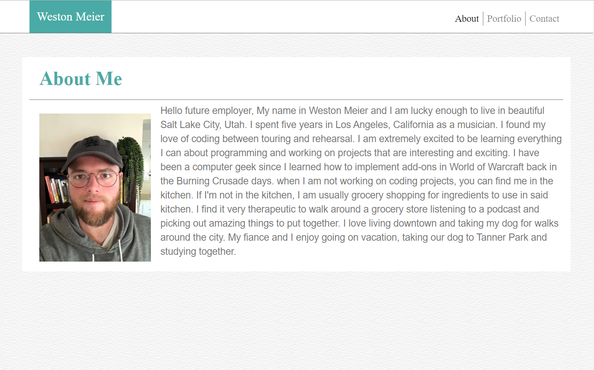
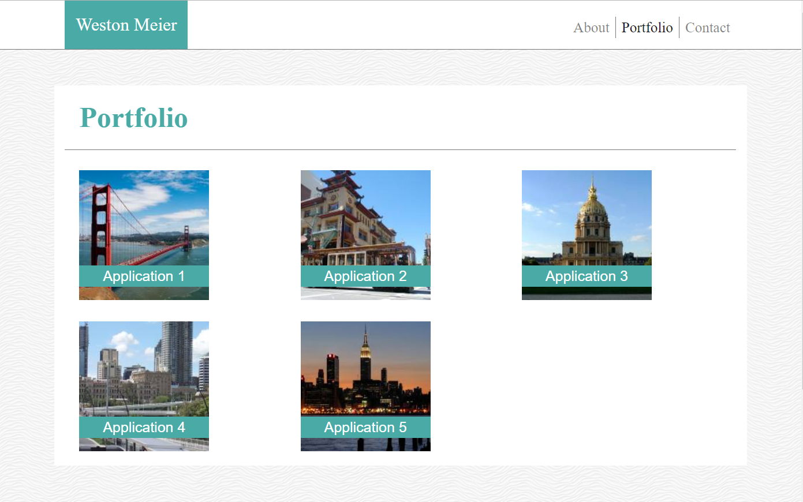
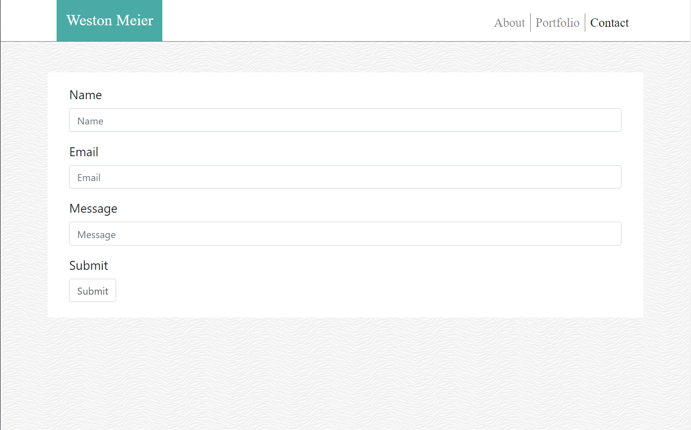

# bootstrap_homework_2

https://westonbmeier.github.io/bootstrap_homework_2/

# This is my portfolio outfitted with bootstrap. 

I have recreated my original portfolio using bootstrap. The reason being is that it is compatible for more viewports so the pages can be seen on more media.  

I have taken code from bootstrap for the nav bar in the header of the HTML. The source code for that can be found here: (https://getbootstrap.com/docs/4.0/components/navbar/). 

I have also used this page for the form inputs in the contact section of the page. That code can be found here: (https://getbootstrap.com/docs/4.0/components/forms/)

The fonts and all colors used are from the previous portfolio I made in week one. 

The background image is ("../so-white/so-white.png"); and can be found at this url: https://www.toptal.com/designers/subtlepatterns/?s=white-waves.png

The font families used are : (Arial, Helvetica, sans-serif;) as well as (Georgia, 'Times New Roman', Times, serif;). 

All colors used on the page are also the same as the previous portfolio. 
Background color is: white
Font color is: #7777777
Border color is: #cccccc
The blue color used for the pages is: #4aaaa5

The profile picture and all placeholder images are the same as the prior portfolio as well. 

Screenshots: 

